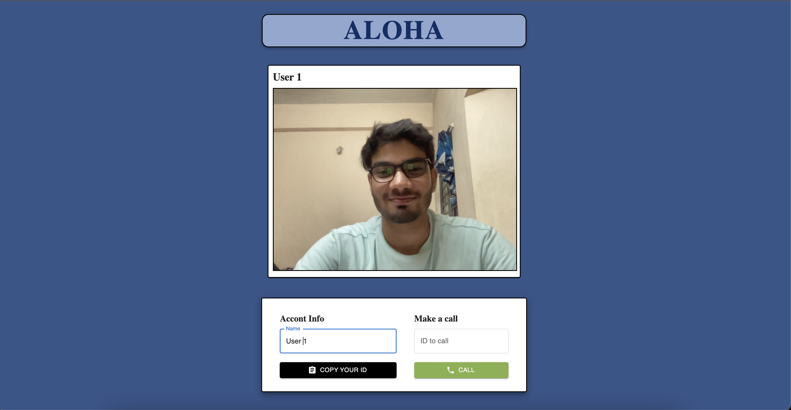
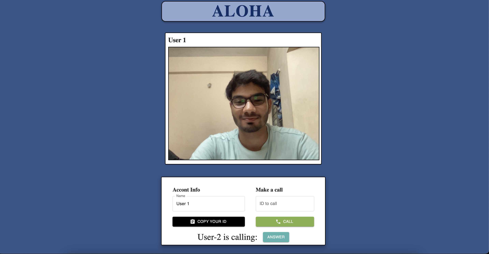
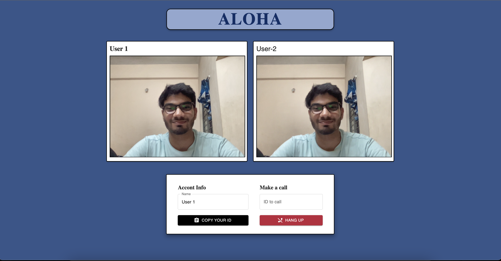

# Aloha, Video-Call Application

This is a one-to-one video call application that allows users to communicate in real-time. The app provides seamless media streaming for effective communication.

## Features

* Video Call: Users can make one-to-one video calls with each other using their webcams and microphones.
* Call Acceptance: When a user initiates a call, the recipient can accept the call request to start the video call.
* Hang Up: Users can end the video call by clicking on the "Hang Up" button.
* Call Notifications: Users receive notifications when they receive a call and when the call is accepted.

#### Good quality video streaming:

#### Notification of incoming call:

#### Hang-up option in ongoing call:

## Tech-Stack used :

  
  
  
  
  
  
  
  
